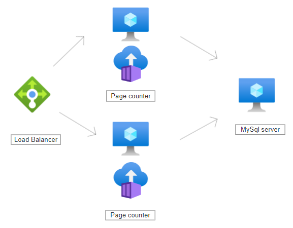
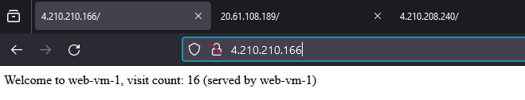

# This repo contains 2 tasks 

- Create cert checker more details [HERE](./cert-check/README.md)

- Create Azure HA app with DB more details [HERE](./infra/README.md)

## How to us it 

- Make sure you have [Python](https://www.python.org/downloads/), Bash or interpreter for the cert checker task
- Make sure you have [Terraform](https://developer.hashicorp.com/terraform/install?product_intent=terraform) for the Azure HA app

- Or just use [Vagrant](https://developer.hashicorp.com/vagrant/install?product_intent=vagrant) with ready env

### Lets start with cert checker
 - Clone the repo 
 ```sh
git clone https://github.com/chavo1/cert-checker-azure-pagecounter.git
cd cert-checker-azure-pagecounter
vagrant up
vagrant ssh 
cd /vagrant/cert-check
[root@master-1 cert-check]# bash checker.sh 
The SSL/TLS certificate for example.com expires on: 2025-03-01 23:59:59
[root@master-1 cert-check]# python checker.py 
The SSL/TLS certificate for example.com expires on 2025-03-01 23:59:59
```
### Terraform Azure 
```sh
git clone https://github.com/chavo1/cert-checker-azure-pagecounter.git
cd cert-checker-azure-pagecounter
vagrant up
vagrant ssh 
cd /vagrant/infra
```
- Make sure you have the Azure credentials check the example.tfvars add you details and rename it to terraform.tfvars

```sh
terraform init
terraform plan
terraform apply
```
#### Here is the very high level diagram



- Once deployed from the load balancer IP (in the output) you should see a webpage with counter and the source VM



- If some of the page counter services go down the traffic will be redirected to the other and vice versa

## Don't forget to destroy the infra 

```sh
terraform destroy
```


